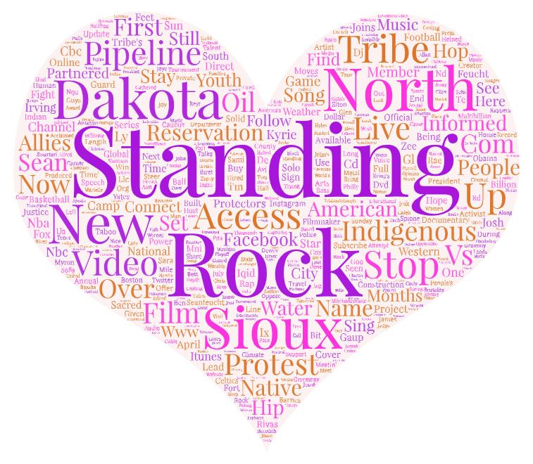
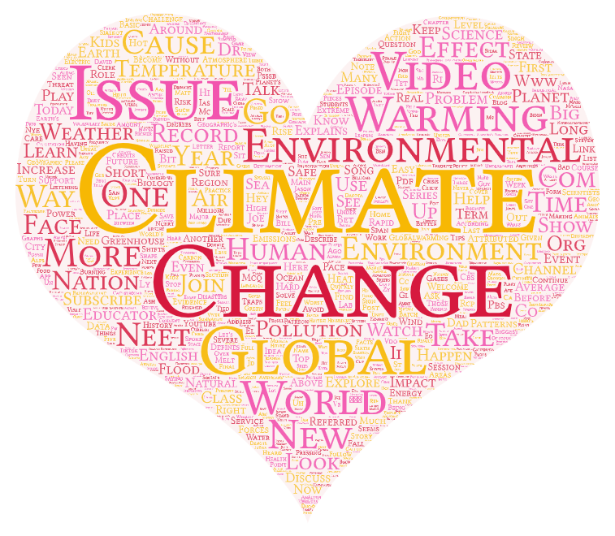

# YouTube-Data-Analysis
## Overview

This project involves the analysis of YouTube data using a Python script (`youtube.ipynb`). The script was run with a self-determined group of search terms and/or locations to explore topics related to climate change, global warming, and environmental issues.

## File Structure

## Research Narrative

### Topic and Parameters
I focused on exploring videos related to climate change, global warming, and environmental issues. The search terms used were ["climate change", "global warming", "environmental issues"].

### Purpose of Comparison
The goal was to compare and contrast the content and engagement of videos across these topics to identify patterns and variations.

## Word Cloud Comparison

Two word clouds were generated, representing the search term "Standing Rock" and the combined search terms related to climate change. The comparison reveals distinct differences in the most frequently used words between the two datasets.

## Patterns and Observations

The word clouds indicate that for "Standing Rock," the prominent words are associated with specific events, locations, or aspects related to the term. On the other hand, the word cloud for climate change reflects a broader set of topics, highlighting various subtopics and concerns within the overarching theme.

## Possible Reasons

The observed patterns could be attributed to the specificity of "Standing Rock" as a singular term focusing on a particular event or topic. In contrast, the broad search terms related to climate change encompass a wide array of subjects, contributing to a more diverse word cloud.

## Future Improvements

In future research, improvements could be made by refining the search terms or incorporating additional parameters to obtain more targeted results. Adjusting the data collection strategy or exploring specific regions or communities might provide nuanced insights into public sentiment and discussions.

## Unexpected Findings

An unexpected finding was the prominence of certain keywords in the climate change word cloud that might not have been immediately associated with the topic. This unexpected discovery opens avenues for further investigation into unconventional aspects of the climate change discourse.

## Word Clouds

### Standing Rock

### Climate Change

## Data Download

To download the result spreadsheets (CSV files), click the links below:

- [Download Standing Rock Data](assets/Standing_Rock.csv)
- [Download Climate Change Data](assets/Climate_change.csv)
